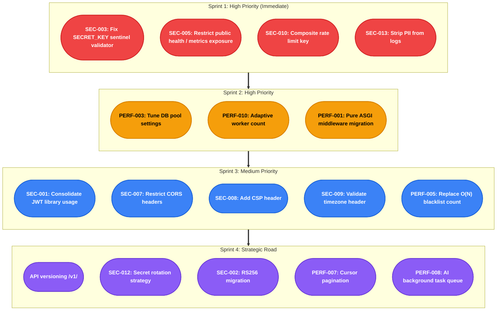

# FastAPI Production Readiness Audit Report
>
> **Project:** BaliBlissed Backend | **Date:** 2026-03-03 | **Auditor:** Zero-Trust Security Review
> **Framework:** FastAPI + Python 3.13 | **Methodology:** OWASP API Top 10 (2023), CIS Docker Benchmark, RFC 7807

---

## Executive Summary

| Metric | Value |
| ----- | ----- |
| **Overall Readiness Score** | **7.5 / 10** |
| **Critical Issues** | 0 |
| **High Issues** | 6 |
| **Medium Issues** | 13 |
| **Low Issues** | 2 |
| **Architecture Rating** | Layered (Repository + Service) with **Good** implementation |
| **Security Posture** | Above-average — JWT, Argon2id, token blacklist, rate limiting all present |
| **Observability** | Good — Prometheus, OpenTelemetry, structural logging, health probes |
| **DB Resilience** | Good — async SQLAlchemy, pool config, transaction manager, indexed models |
| **Production Readiness** | 7/10 — Docker multi-stage, non-root user, but missing resource limits + secret rotation |

**Verdict:** This is a well-architected codebase with solid security fundamentals. The primary concerns are operational security (static environment-based secret handling, PII in logs, and unauthenticated health/metrics exposure) and performance tuning (middleware overhead, pool sizing, AI blocking requests). The team should be proud of what's been implemented — this report focuses on closing the gap between "good" and "enterprise-grade."

---

## Risk Heat Map

| Quadrant | Severity | Exploitability | Action |
| ---------- | -------- | -------------- | ------ |
| **Critical Action** 🔴 | High | High | Immediate remediation required |
| **Monitor Closely** 🟡 | High | Low | Track and plan fixes |
| **Quick Wins** 🟢 | Low | High | Easy fixes — do soon |
| **Low Priority** ⚪ | Low | Low | Address when convenient |

### Risk Distribution Matrix

| ID | Issue | Exploitability | Severity | Priority |
| -- | ----- | -------------- | -------- | -------- |
| SEC-012 | Static Secret Management | 🟨 Med (0.55) | 🟥 High (0.75) | **High** |
| SEC-005 | Public Health / Metrics Exposure | 🟥 High (0.75) | 🟥 High (0.80) | **High** |
| SEC-013 | PII in Logs | 🟨 Med (0.60) | 🟥 High (0.70) | **High** |
| SEC-003 | Weak Key Default Validator | 🟩 Low (0.30) | 🟩 Low (0.35) | **Low** |
| SEC-002 | HS256 Algorithm | 🟩 Low (0.40) | 🟨 Med (0.55) | **Monitor** |
| PERF-003 | Pool Defaults May Be Undersized | 🟥 High (0.80) | 🟨 Med (0.65) | **High** |
| PERF-010 | Hardcoded Workers | 🟥 High (0.70) | 🟨 Med (0.60) | **High** |
| PERF-001 | Middleware Overhead | 🟨 Med (0.50) | 🟨 Med (0.60) | **Medium** |
| SEC-001 | Dual JWT Libraries / `python-jose` Usage | 🟩 Low (0.45) | 🟨 Med (0.55) | **Medium** |
| SEC-010 | No User-Aware Rate Limit Key | 🟨 Med (0.65) | 🟨 Med (0.60) | **Medium** |
| SEC-007 | CORS allow_all headers | 🟨 Med (0.65) | 🟩 Low (0.50) | **Quick Win** |
| SEC-008 | Missing CSP | 🟨 Med (0.55) | 🟩 Low (0.45) | **Quick Win** |
| PERF-007 | Offset Pagination | 🟥 High (0.85) | 🟩 Low (0.45) | **Quick Win** |

### Priority Summary

| Category | Count | Items |
| --------- | ----- | ----- |
| 🔴 **Critical** | 0 | None validated from repository evidence |
| 🟡 **High** | 5 | SEC-012, SEC-005, SEC-013, PERF-003, PERF-010 |
| 🟢 **Medium** | 3 | PERF-001, SEC-001, SEC-010 |
| 🔵 **Quick Wins** | 3 | SEC-007, SEC-008, PERF-007 |

---

## Critical Findings

No repository-verified findings rose to **critical** severity in this validation pass.

### Reclassification Note

- **SEC-012** remains a real operational-security gap, but the current repository supports a **high** severity rating rather than critical: secrets are static environment-based values, and rotation is not evident in the application/runtime configuration.
- **SEC-003** remains valid as a **low** severity configuration bug: the `SECRET_KEY` validator checks the wrong sentinel value.

---

## High Findings

| ID | Issue | File | Line | Severity | Impact |
| ----- | ----- | ----- | ----- | ----- | ----- |
| SEC-012 | Static environment-based secrets; no rotation mechanism evident in repo | `secrets/.env`, `settings.py` | — | HIGH | Secret changes require config / deploy updates |
| SEC-005 | `/health` is public; `/metrics/legacy` is public but rate-limited; `/metrics` has no auth gate when enabled | `routes/health.py`, `monitoring/prometheus.py` | 205, 342 / — | HIGH | System state exposure |
| SEC-013 | Client IP in access logs; some service logs include user-provided name and IP | `middleware/middleware.py`, `services/email_inquiry.py` | 277–294 / — | HIGH | CWE-532 privacy exposure |
| PERF-001 | 5× `BaseHTTPMiddleware` stacking | All middleware files | — | HIGH | 5–15% latency overhead |
| PERF-003 | DB pool defaults (5+10) may be undersized for a 4-worker deployment | `settings.py` | 105–107 | HIGH | Connection pressure at load |
| PERF-010 | Hardcoded `--workers 4` in Dockerfile | `Dockerfile` | 78 | HIGH | CPU mismatch on small/large instances |

---

## Medium Findings

| ID | Issue | File | Line | Severity | Effort |
| ----- | ----- | ----- | ----- | ----- | ----- |
| SEC-001 | Active use of `python-jose`; `PyJWT` is also installed | `pyproject.toml`, `managers/token_manager.py` | 54 / — | MEDIUM | 30 min |
| SEC-002 | HS256 symmetric JWT — shared secret risk if secret leaks | `settings.py` | 112 | MEDIUM | 1 day |
| SEC-010 | Rate limit identifier missing user ID (API key spoofable) | `managers/rate_limiter.py` | 19–35 | MEDIUM | 1 hr |
| SEC-007 | `allow_headers=["*"]` in CORS | `middleware/middleware.py` | 216 | MEDIUM | 30 min |
| SEC-008 | Missing CSP / Permissions-Policy headers | `middleware/middleware.py` | 382–388 | MEDIUM | 1 hr |
| SEC-009 | `X-Client-Timezone` header not IANA-validated | `middleware/timezone.py` | 48–51 | MEDIUM | 1 hr |
| PERF-002 | `get_event_loop()` deprecated in Python 3.12+ | `middleware/middleware.py` | 28 | MEDIUM | 30 min |
| PERF-004 | No eager loading convention — latent N+1 risk as relationships grow | `repositories/base.py`, `repositories/user.py` | — | MEDIUM | 2 hr |
| PERF-005 | `scan_iter` for blacklist count is O(N) | `managers/token_blacklist.py` | 118–131 | MEDIUM | 1 hr |
| PERF-007 | Offset-based pagination (slow at scale) | `repositories/base.py` | — | MEDIUM | 4 hr |
| PERF-008 | AI requests block request lifecycle (60s possible) | `routes/ai.py` | — | MEDIUM | 3 days |
| PERF-011 | `redis-commander` is present in main compose (not isolated to a dev-only profile) | `docker-compose.yaml` | 41–52 | MEDIUM | 15 min |
| PERF-012 | No CPU/memory resource limits on services | `docker-compose.yaml` | — | MEDIUM | 30 min |

---

## Low Findings

| ID | Issue | File | Severity |
| ----- | ----- | ----- | ----- |
| SEC-003 | `validate_secret_key` checks the wrong sentinel string | `settings.py` | LOW |
| SEC-011 | `rich.print` import in `security.py` (potential config leak) | `configs/security.py:10` | LOW |

---

## Detailed Analysis by Dimension

### 1. Security

See [security.md](./security.md) for full analysis.

**Key findings:**

- ✅ **Excellent:** JWT implementation with JTI, `iat`/`exp`/`iss`/`aud`, token type discrimination, and Redis-backed blacklist with TTL
- ✅ **Excellent:** Argon2id password hashing with configurable security levels (development/standard/high/paranoid); CPU-bound work in executor
- ✅ **Excellent:** Account lockout after 5 failed attempts via `LoginAttemptTracker`
- ✅ **Good:** Security headers (HSTS, X-Frame-Options, X-Content-Type-Options, Referrer-Policy)
- ✅ **Good:** CORS with explicit origin allowlist (no `*`)
- ✅ **Good:** Role-based authorization chain (`AdminUserDep`, `ModeratorUserDep`, `VerifiedUserDep`, `check_owner_or_admin`)
- ⚠️ **Gap:** No CSP header, `allow_headers=["*"]` in CORS
- ⚠️ **Gap:** Public health/metrics endpoints expose system state
- ⚠️ **Gap:** No secret rotation capability

---

### 2. Data Persistence

**Key findings:**

- ✅ **Excellent:** SQLAlchemy 2.0 async with `asyncpg` — no sync DB calls
- ✅ **Excellent:** `transaction()` context manager handles commit/rollback/close correctly
- ✅ **Excellent:** `pool_pre_ping=True`, statement timeout (30s), lock timeout (30s)
- ✅ **Good:** Repository pattern with `BaseRepository[ModelT, CreateSchemaT, UpdateSchemaT]` — generic CRUD
- ✅ **Good:** GIN index on `blogs.tags` JSONB, composite indexes on `reviews`, `blogs`
- ✅ **Good:** `expire_on_commit=False` prevents implicit lazy-loads post-commit
- ✅ **Good:** Alembic with async env and forward-compatible migrations
- ⚠️ **Gap:** Default pool size (5+10) may be undersized for a 4-worker production deployment
- ⚠️ **Gap:** No cursor-based pagination — deep offset queries degrade
- ⚠️ **Gap:** No eager loading policy — latent N+1 risk grows with relationship-heavy queries

---

### 3. Observability

**Key findings:**

- ✅ **Excellent:** OpenTelemetry SDK with OTLP exporter and Jaeger integration
- ✅ **Excellent:** Prometheus instrumentation via `prometheus-fastapi-instrumentator` with custom metrics (cache, AI, circuit breaker)
- ✅ **Excellent:** Cardinality protection — user IDs/emails never used as label values
- ✅ **Excellent:** Structured logging with `structlog` — JSON format, correlation via `X-Request-ID`
- ✅ **Excellent:** Liveness (`/health/live`) and readiness (`/health/ready`) probes (Kubernetes-compatible)
- ✅ **Good:** Request ID propagated as `X-Request-ID` response header
- ✅ **Good:** `LOG_EXCLUDED_PATHS` for health/metrics (reduces log noise)
- ⚠️ **Gap:** `SENTRY_DSN` configured in settings but Sentry SDK never initialized in `main.py`
- ⚠️ **Gap:** Access logs include client IP, and some service logs include user-provided PII (GDPR concern)
- ⚠️ **Gap:** `/metrics` has no auth gate when enabled; `/metrics/legacy` is also public, though rate-limited

**Sentry Fix (Missing integration):**

```python
# app/main.py — add after configure_logging()
import sentry_sdk
from sentry_sdk.integrations.fastapi import FastApiIntegration
from sentry_sdk.integrations.sqlalchemy import SqlalchemyIntegration

if settings.SENTRY_DSN:
    sentry_sdk.init(
        dsn=settings.SENTRY_DSN,
        environment=settings.ENVIRONMENT,
        traces_sample_rate=settings.SENTRY_TRACES_SAMPLE_RATE,
        integrations=[FastApiIntegration(), SqlalchemyIntegration()],
        send_default_pii=False,  # GDPR: don't send PII
    )
```

---

### 4. Error Resilience

**Key findings:**

- ✅ **Excellent:** Custom exception hierarchy (`BaseAppError`, domain-specific errors) with dedicated handlers
- ✅ **Excellent:** `RequestValidationError` handler provides consistent format
- ✅ **Excellent:** `CircuitBreakerError` with configurable `failure_threshold=5`, `recovery_timeout=60s`
- ✅ **Good:** Transaction rollback on any exception in `transaction()` context manager
- ✅ **Good:** `@with_retry` decorator on password hashing with exponential backoff
- ✅ **Good:** Idempotency middleware with fail-open behavior on Redis unavailability
- ⚠️ **Gap:** No custom global `HTTPException` handler — FastAPI default error responses remain in use
- ⚠️ **Gap:** Error responses are not RFC 7807 (Problem Details) compliant — use custom format

**RFC 7807 Compliance Gap:**

Current response format:

```json
{"detail": "User not found"}
```

RFC 7807-compliant format:

```json
{
  "type": "https://api.baliblissed.com/errors/not-found",
  "title": "Resource Not Found",
  "status": 404,
  "detail": "User with ID abc123 was not found",
  "instance": "/users/abc123"
}
```

---

### 5. Scalability

**Key findings:**

- ✅ **Good:** Async throughout — no blocking I/O in request path  
- ✅ **Good:** Redis cache with configurable TTLs (`CACHE_TTL_ITINERARY`, `CACHE_TTL_QUERY`)
- ✅ **Good:** `MAX_PAGE_SIZE=100` enforced; `DEFAULT_PAGE_SIZE=10`
- ✅ **Good:** `MAX_REQUEST_SIZE_MB=10` configured
- ✅ **Good:** `GZipMiddleware` for response compression
- ⚠️ **Gap:** AI requests run synchronously in the request lifecycle — 60s timeout blocks a worker
- ✅ **Good:** Cache manager implements request coalescing for cache fills (thundering-herd protection)
- ⚠️ **Gap:** Offset pagination will degrade for large datasets

---

### 6. Maintainability & DX

**Key findings:**

- ✅ **Excellent:** Comprehensive `ruff` linting with security (bandit), type annotations, import ordering
- ✅ **Excellent:** Repository + Service + Schema layer separation — clean boundaries
- ✅ **Excellent:** Generic `BaseRepository[ModelT, CreateSchemaT, UpdateSchemaT]` — DRY compliance  
- ✅ **Excellent:** CI config includes an 80% coverage gate (`--cov-fail-under=80`)
- ✅ **Good:** Pydantic v2 for all schemas
- ✅ **Good:** `uv` with `uv.lock` — deterministic dependency resolution
- ⚠️ **Gap:** Both `PyJWT` and `python-jose` are installed, while current JWT code uses `python-jose`
- ⚠️ **Gap:** `psycopg2-binary` in production dependencies — sync driver that shouldn't be needed alongside `asyncpg`
- ⚠️ **Gap:** `pyrefly` is configured in CI, but the GitHub Actions workflow is currently manual-only (`workflow_dispatch`)

**Unused `psycopg2-binary` Dependency:**

```diff
# pyproject.toml
- "psycopg2-binary>=2.9.11",   # sync driver — not needed with asyncpg
```

`psycopg2` is a synchronous PostgreSQL driver. Since the app uses `asyncpg` exclusively, `psycopg2-binary` adds ~10MB to the image with no functional benefit. The only legitimate use would be for Alembic during migrations — but `asyncpg` handles that too.

---

### 7. Production Readiness

**Key findings:**

- ✅ **Excellent:** Multi-stage Docker build (builder → production → development)
- ✅ **Excellent:** Non-root user (`appuser`, uid 5678)
- ✅ **Excellent:** `HEALTHCHECK` in Dockerfile with start-period 60s
- ✅ **Excellent:** `DB_PASSWORD:?` — Docker compose fails fast if password unset
- ✅ **Good:** Docs endpoint is controlled via `DOCS_ENABLED`
- ⚠️ **Gap:** `DOCS_ENABLED` defaults to `True`; production safety depends on environment override
- ⚠️ **Gap:** No container resource limits
- ⚠️ **Gap:** Hardcoded `--workers 4`
- ⚠️ **Gap:** `redis-commander` is present in the main compose file and not isolated to a dev-only profile

---

### 8. API Design

**Key findings:**

- ✅ **Good:** HTTP verbs used correctly (GET for reads, POST for creates, PUT/PATCH for updates, DELETE)
- ✅ **Good:** Proper HTTP status codes (201 for creates, 200 for reads, 204 for deletes)
- ✅ **Good:** `ORJSONResponse` throughout for performance
- ✅ **Good:** `Idempotency-Key` middleware for mutation endpoints
- ✅ **Good:** OpenAPI schema auto-generated; docs conditionally enabled
- ⚠️ **Gap:** No API versioning (`/v1/`) — first breaking change will have no migration path
- ⚠️ **Gap:** Error responses don't follow RFC 7807 Problem Details format
- ⚠️ **Gap:** No `Retry-After` header on rate-limit responses (only in body)

---

### 9. Compliance & Governance

**Key findings:**

- ✅ **Good:** Structured logging for audit trail  
- ✅ **Good:** `LEFT JOIN` / `INNER JOIN` patterns via SQLAlchemy (no raw SQL)
- ⚠️ **Gap:** No GDPR right-to-erasure endpoint (user deletion permanently removes data, but no dedicated `/users/me/data-export` or `/users/me` DELETE cascade verification)
- ⚠️ **Gap:** PII appears in logs (client IP in middleware logs; caller name/IP in at least one service path)
- ⚠️ **Gap:** No data retention policy / automated purging
- ⚠️ **Gap:** No audit log (immutable trail of privilege operations)

---

## Dead Code Analysis

| Item | Location | Confidence | Notes |
| ----- | ----- | ----- | ----- |
| `psycopg2-binary` dependency | `pyproject.toml:50` | Medium | Present in dependencies; current app code uses `asyncpg`, and runtime use is not evident from repository scan |
| `PyJWT` dependency | `pyproject.toml` | Medium | `python-jose` is the active JWT library in current code; `PyJWT` appears unused in app code |
| `verify_redis_connection()` | `managers/rate_limiter.py:41` | High | Function logs but does nothing (no actual test) |
| Commented rate-limit headers | `managers/rate_limiter.py:82–95` | Medium | 4 commented-out lines referencing response headers |
| `metrics_manager` field in `CircuitBreakerConfig` | `managers/circuit_breaker.py` | Medium | Marked `# Deprecated: use Prometheus metrics directly` |
| `UploadError` / `upload_exception_handler` | `errors/__init__.py:52–61` | Medium | `upload_exception_handler` imported but not registered in `main.py` |

---

## Architecture Assessment

### Strengths

```text
┌─────────────────────────────────────────────────────────────────┐
│                     Architecture Layers                         │
├─────────────────────────────────────────────────────────────────┤
│  Routes          → APIRouter + Pydantic schemas (request/resp) │
│  Dependencies    → FastAPI DI container (stable, injected)     │
│  Services        → AuthService, EmailTemplate (domain logic)   │
│  Repositories    → BaseRepository[T] (data access)            │
│  Models          → SQLModel (DB schema)                        │
│  Schemas         → Pydantic v2 (wire format, validation)       │
│  Managers        → TokenBlacklist, CacheManager, RateLimiter   │
│  Clients         → RedisClient, AiClient, EmailClient          │
└─────────────────────────────────────────────────────────────────┘
```

**Architecture compliance:**

- ✅ Hexagonal-adjacent: Domain logic in Services, Data access in Repositories
- ✅ DI via FastAPI `Depends()` — fully testable
- ✅ No circular imports detected (separate layers with clear direction)
- ✅ Single Responsibility: Middleware, Managers, Services each have bounded context

### Areas for Improvement

1. **API Versioning:** Add `v1` prefix before first breaking change
2. **Background Jobs:** AI workloads should be async tasks, not blocking handlers  
3. **Secret Rotation:** Move to Vault/Secrets Manager integration
4. **Test Coverage:** Consider contract tests for API schemas (consumer-driven tests)

---

## Recommended Priority Action Plan



---

## References

| Standard | URL |
| ---------- | ----- |
| OWASP API Security Top 10 (2023) | <https://owasp.org/www-project-api-security/> |
| OWASP Top 10 (2021) | <https://owasp.org/Top10/> |
| RFC 7807 — Problem Details | <https://tools.ietf.org/html/rfc7807> |
| CIS Docker Benchmark | <https://www.cisecurity.org/benchmark/docker> |
| NIST Cybersecurity Framework | <https://www.nist.gov/cyberframework> |
| Argon2 OWASP Guidance | <https://cheatsheetseries.owasp.org/cheatsheets/Password_Storage_Cheat_Sheet.html> |
| FastAPI Best Practices | <https://fastapi.tiangolo.com/deployment/concepts/> |

---

*For detailed findings, see:*

- [Security Findings →](./security.md)
- [Performance Findings →](./performance.md)
- [Remediation Plan →](./remediation_plan.md)
