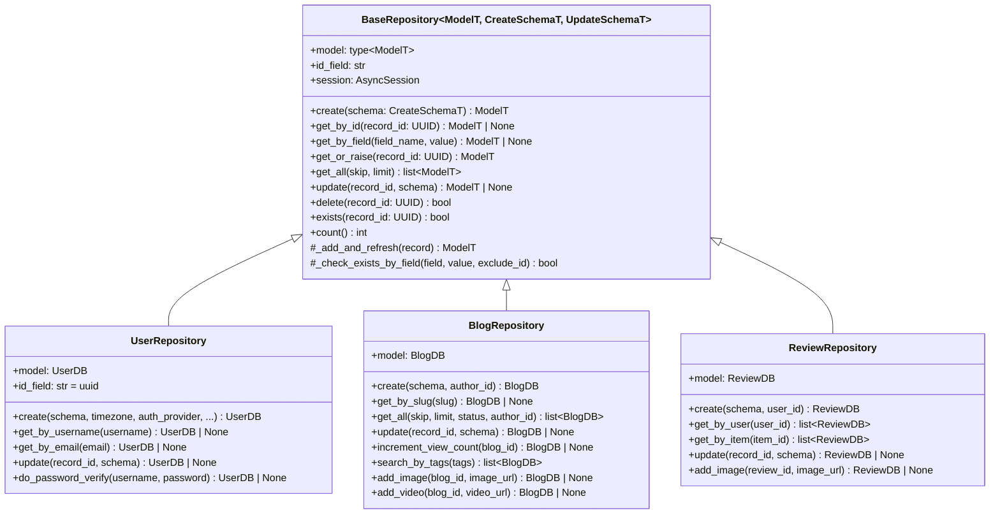
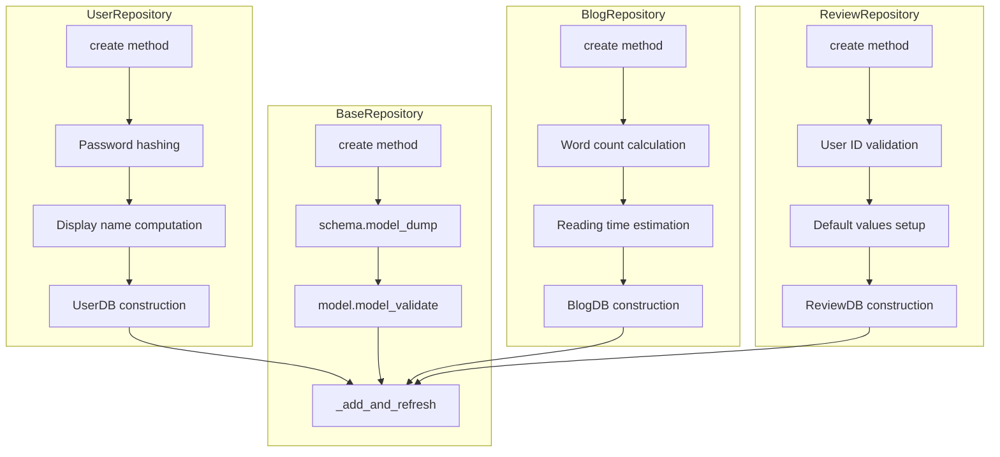

# BaseRepository Architectural Analysis

## Executive Summary

This document analyzes the [`BaseRepository`](app/repositories/base.py:24) class, traces the method resolution order for the `create()` function across concrete implementations, and critically evaluates the utility of this abstraction.

---

## 1. Architectural Purpose and Core Responsibilities

### 1.1 Class Definition

```python
class BaseRepository[ModelT: SQLModel, CreateSchemaT: BaseModel, UpdateSchemaT: BaseModel]:
```

The [`BaseRepository`](app/repositories/base.py:24) is a **generic base class** implementing the Repository Pattern with three type parameters:

| Type Parameter | Constraint | Purpose |
| -------------- | ---------- | ------- |
| `ModelT` | `SQLModel` | Database entity model |
| `CreateSchemaT` | `BaseModel` | Pydantic schema for creation operations |
| `UpdateSchemaT` | `BaseModel` | Pydantic schema for update operations |

### 1.2 Core Responsibilities

The base class provides **10 public methods** and **2 protected helper methods**:

#### Public CRUD Operations

| Method | Lines | Purpose |
| ------ | ----- | ------- |
| [`create()`](app/repositories/base.py:49) | 49-64 | Create new record from schema |
| [`get_by_id()`](app/repositories/base.py:66) | 66-79 | Retrieve by primary key |
| [`get_by_field()`](app/repositories/base.py:81) | 81-99 | Retrieve by arbitrary field |
| [`get_or_raise()`](app/repositories/base.py:101) | 101-119 | Get or raise `RecordNotFoundError` |
| [`get_all()`](app/repositories/base.py:121) | 121-138 | Paginated list retrieval |
| [`update()`](app/repositories/base.py:140) | 140-163 | Update record from schema |
| [`delete()`](app/repositories/base.py:165) | 165-181 | Delete by ID |
| [`exists()`](app/repositories/base.py:183) | 183-197 | Check existence without loading |
| [`count()`](app/repositories/base.py:199) | 199-209 | Total record count |

#### Protected Helper Methods

| Method | Lines | Purpose |
| ------ | ----- | ------- |
| [`_add_and_refresh()`](app/repositories/base.py:211) | 211-240 | Add to session with error handling |
| [`_check_exists_by_field()`](app/repositories/base.py:242) | 242-268 | Existence check by field value |

### 1.3 Design Patterns Employed



---

## 2. Method Resolution Order Analysis for `create()`

### 2.1 Base Implementation

The base [`create()`](app/repositories/base.py:49) method follows this algorithm:

```python
async def create(self, schema: CreateSchemaT, **kwargs: dict[str, Any]) -> ModelT:
    data = schema.model_dump(exclude_unset=True)  # Convert to dict
    db_obj = self.model.model_validate(data)       # Validate & create model
    return await self._add_and_refresh(db_obj)     # Persist with error handling
```

**Key characteristics:**

- Simple schema-to-model conversion
- Ignores `**kwargs` (accepts but doesn't use)
- No business logic or computed fields

### 2.2 UserRepository.create() - FULL OVERRIDE

**Location:** [`app/repositories/user.py:52-105`](app/repositories/user.py:52)

```python
async def create(
    self,
    schema: UserCreate,
    timezone: str | None = None,
    auth_provider: str = "email",
    provider_id: str | None = None,
    *,
    is_verified: bool = False,
    **kwargs: dict[str, Any],
) -> UserDB:
```

**Override Reason:** Complex user creation requires:

| Business Logic | Description |
| -------------- | ----------- |
| Password hashing | `hash_password(schema.password.get_secret_value())` |
| Display name computation | `compute_display_name(first_name, last_name, username)` |
| OAuth integration | `auth_provider`, `provider_id` parameters |
| Timezone support | Optional `timezone` parameter |
| Verification status | Pre-verified for OAuth users |

**Method Resolution Order:**

```text
UserRepository.create() → UserDB construction → _add_and_refresh() [inherited]
```

### 2.3 BlogRepository.create() - FULL OVERRIDE

**Location:** [`app/repositories/blog.py:69-123`](app/repositories/blog.py:69)

```python
async def create(
    self,
    schema: BlogSchema,
    author_id: UUID | None = None,
    **kwargs: dict[str, Any],
) -> BlogDB:
```

**Override Reason:** Blog creation requires:

| Business Logic | Description |
| -------------- | ----------- |
| Word count calculation | `calculate_word_count(schema.content)` |
| Reading time estimation | `calculate_reading_time(word_count)` |
| Author association | Required `author_id` parameter |
| Timestamp management | `created_at`, `updated_at` initialization |
| URL list conversion | Convert `HttpUrl` to `str` for storage |
| Friendly error messages | Custom `DuplicateEntryError` for slug conflicts |

**Method Resolution Order:**

```text
BlogRepository.create() → BlogDB construction → _add_and_refresh() [inherited]
```

### 2.4 ReviewRepository.create() - FULL OVERRIDE

**Location:** [`app/repositories/review.py:33-67`](app/repositories/review.py:33)

```python
async def create(
    self,
    schema: ReviewCreate,
    user_id: UUID | None = None,
    **kwargs: dict[str, Any],
) -> ReviewDB:
```

**Override Reason:** Review creation requires:

| Business Logic | Description |
| -------------- | ----------- |
| User association | Required `user_id` parameter |
| Default values | `is_verified_purchase=False`, `helpful_count=0` |
| Timestamp initialization | `created_at` with UTC normalization |
| Validation | Raises `ValueError` if `user_id` is missing |

**Method Resolution Order:**

```text
ReviewRepository.create() → ReviewDB construction → _add_and_refresh() [inherited]
```

### 2.5 Method Resolution Order Summary



**Key Finding:** All three concrete repositories **fully override** the `create()` method. The base implementation is **never used directly**.

---

## 3. Critical Evaluation of BaseRepository Utility

### 3.1 Arguments FOR the Abstraction

#### ✅ Shared Infrastructure

| Feature | Benefit |
| ------- | ------- |
| `_add_and_refresh()` | Centralized error handling for `IntegrityError`, connection errors |
| Session management | Consistent `AsyncSession` injection pattern |
| Type safety | Generic type parameters enforce schema-model consistency |

#### ✅ Inherited Methods Actually Used

| Method | Used By |
| ------ | ------- |
| `get_by_id()` | All repositories |
| `get_by_field()` | All repositories (via `get_by_username`, `get_by_slug`, etc.) |
| `get_or_raise()` | All repositories |
| `exists()` | All repositories |
| `delete()` | All repositories |
| `count()` | All repositories |
| `_add_and_refresh()` | All repositories (in overridden `create()` and `update()`) |

#### ✅ Consistent API Contract

All repositories share the same method signatures for common operations, enabling:

- Dependency injection patterns
- Predictable testing interfaces
- Documentation consistency

### 3.2 Arguments AGAINST the Abstraction

#### ❌ Base `create()` is Never Used

```python
# Base implementation - NEVER CALLED
async def create(self, schema: CreateSchemaT, **kwargs: dict[str, Any]) -> ModelT:
    data = schema.model_dump(exclude_unset=True)
    db_obj = self.model.model_validate(data)
    return await self._add_and_refresh(db_obj)
```

**Problem:** Every concrete repository overrides `create()` because:

1. Entities require computed fields not in schemas
2. Entities need relationships (author_id, user_id)
3. Business logic (password hashing, word counts) is entity-specific

#### ❌ Base `update()` is Partially Overridden

| Repository | Override Status | Reason |
| ---------- | --------------- | ------ |
| UserRepository | Full override | Password hashing, display_name recomputation |
| BlogRepository | Full override | Word count recalculation, slug validation |
| ReviewRepository | Full override | Different commit pattern (uses `commit()` vs `flush()`) |

#### ❌ Base `get_all()` is Overridden

| Repository | Override Status | Reason |
| ---------- | --------------- | ------ |
| UserRepository | Not overridden | Uses base implementation |
| BlogRepository | Full override | Status/author filtering, ordering |
| ReviewRepository | Not overridden | Uses base implementation |

### 3.3 Utility Assessment Matrix

| Method | Base Used | Override Required | Utility Score |
| ------ | ------- | ----------------- | ------------- |
| `create()` | ❌ Never | ✅ Always | **Low** |
| `update()` | ❌ Never | ✅ Always | **Low** |
| `get_all()` | ⚠️ Sometimes | ⚠️ Sometimes | **Medium** |
| `get_by_id()` | ✅ Always | ❌ Never | **High** |
| `get_by_field()` | ✅ Always | ❌ Never | **High** |
| `get_or_raise()` | ✅ Always | ❌ Never | **High** |
| `delete()` | ✅ Always | ❌ Never | **High** |
| `exists()` | ✅ Always | ❌ Never | **High** |
| `count()` | ✅ Always | ❌ Never | **High** |
| `_add_and_refresh()` | ✅ Always | ❌ Never | **High** |

---

## 4. Recommendations

### 4.1 Keep BaseRepository (Not Redundant)

**Verdict: The abstraction is NECESSARY and provides significant value.**

**Rationale:**

1. **7 of 10 methods** are inherited and used without modification
2. **`_add_and_refresh()`** provides critical centralized error handling
3. **Type safety** through generics prevents schema-model mismatches
4. **Consistent API contract** enables dependency injection patterns

### 4.2 Suggested Improvements

#### Option A: Make `create()` Abstract

```python
from abc import ABC, abstractmethod

class BaseRepository[ModelT, CreateSchemaT, UpdateSchemaT](ABC):
    @abstractmethod
    async def create(self, schema: CreateSchemaT, **kwargs: Any) -> ModelT:
        """Create a new record. Must be implemented by subclasses."""
        ...
```

**Benefit:** Explicitly communicates that `create()` must be customized.

#### Option B: Template Method Pattern

```python
async def create(self, schema: CreateSchemaT, **kwargs: Any) -> ModelT:
    """Template method for creation."""
    data = await self._prepare_create_data(schema, **kwargs)
    db_obj = self._construct_model(data)
    return await self._add_and_refresh(db_obj)

async def _prepare_create_data(self, schema: CreateSchemaT, **kwargs: Any) -> dict[str, Any]:
    """Hook for subclasses to customize data preparation."""
    return schema.model_dump(exclude_unset=True)
```

**Benefit:** Provides structure while allowing customization.

#### Option C: Remove Unused Base `create()` Implementation

Simply document that `create()` should be overridden:

```python
async def create(self, schema: CreateSchemaT, **kwargs: Any) -> ModelT:
    """Create a new record. Subclasses typically override this method."""
    raise NotImplementedError("Subclasses should implement create()")
```

### 4.3 Consistency Fix for ReviewRepository

The [`ReviewRepository.update()`](app/repositories/review.py:123) uses `commit()` instead of `_add_and_refresh()`:

```python
# Current (inconsistent)
await self.session.commit()
await self.session.refresh(db_review)

# Should be (consistent)
return await self._add_and_refresh(db_review)
```

This creates inconsistent transaction handling compared to other repositories.

---

## 5. Conclusion

The `BaseRepository` class is **not redundant** despite `create()` being overridden in all concrete implementations. The class provides:

1. **High-value inherited methods** (7 of 10): `get_by_id`, `get_by_field`, `get_or_raise`, `delete`, `exists`, `count`, `_add_and_refresh`
2. **Centralized error handling**: `_add_and_refresh()` handles `IntegrityError` and connection errors uniformly
3. **Type safety**: Generic constraints prevent schema-model mismatches
4. **Consistent API contract**: Enables dependency injection and predictable testing

The fact that `create()` and `update()` are always overridden reflects **domain complexity**, not **design failure**. These methods require entity-specific business logic that cannot be generalized.

**Final Assessment:** The `BaseRepository` abstraction is **well-justified** and follows the Repository Pattern correctly. The only improvement would be making `create()` abstract or documenting its intended override behavior.
