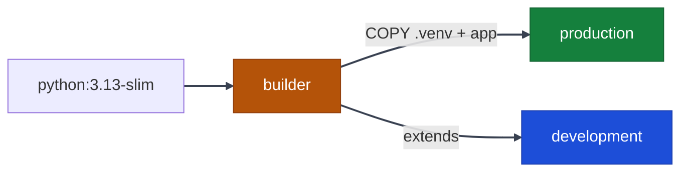

# Dockerfile — Design & Rationale

Comprehensive documentation for the [Dockerfile](../../Dockerfile) used to containerize the BaliBlissed FastAPI backend. Every decision is explained below with the reasoning behind it.

---

## Table of Contents

- [Architecture Overview](#architecture-overview)
- [Stage 1: Builder](#stage-1-builder)
- [Stage 2: Production](#stage-2-production-default)
- [Stage 3: Development](#stage-3-development)
- [Environment Variables](#environment-variables)
- [Security Hardening](#security-hardening)
- [Performance Optimizations](#performance-optimizations)
- [Layer Caching Strategy](#layer-caching-strategy)
- [Health Checks](#health-checks)
- [Usage](#usage)
- [Comparison: Before vs After](#comparison-before-vs-after)

---

## Architecture Overview

The Dockerfile uses a **multi-stage build** pattern with three stages:



| Stage | Purpose | Base | Contains dev deps? | Image size |
| --- | --- | --- | --- | --- |
| `builder` | Install deps, compile bytecode | `python:3.13-slim` | No | ~500MB (discarded) |
| `production` | Minimal runtime image | `python:3.13-slim` (fresh) | No | **~200-300MB** |
| `development` | Hot-reload with dev tools | Extends `builder` | Yes | ~550MB |

> [!IMPORTANT]
> The **production** stage is the default build target. It starts from a **fresh** `python:3.13-slim` base and copies only what's needed from the builder — no build tools, no `uv` binary, no cache artifacts.

---

## Stage 1: Builder

```dockerfile
FROM python:3.13-slim AS builder
COPY --from=ghcr.io/astral-sh/uv:latest /uv /uvx /bin/
```

### Why `python:3.13-slim`?

- **`slim`** variant strips manual pages, docs, and non-essential packages from the Debian base, saving ~400MB compared to the full `python:3.13` image.
- **`3.13`** matches the project's `requires-python = ">=3.13"` in `pyproject.toml`.
- We avoid `alpine` because many Python packages (e.g., `psycopg2-binary`, `argon2-cffi`) rely on glibc and would require compiling C extensions from source on musl-based Alpine, which increases build time and image size.

### Why `COPY --from=ghcr.io/astral-sh/uv:latest`?

Two approaches exist to install `uv`:

| Approach | Speed | Reproducibility | Image size impact |
| --- | --- | --- | --- |
| `pip install uv` | Slow (~10s) | Depends on PyPI state | Adds pip cache layer |
| `COPY --from=ghcr.io/astral-sh/uv:latest` | Instant | Pinned to image digest | Single binary, no cache |

We use the **COPY approach** because it's faster, more reproducible, and adds zero cache bloat. The `uv` binary is only present in the builder stage — it never reaches production.

> [!TIP]
> For even stricter reproducibility, pin the uv version:
>
> ```dockerfile
> COPY --from=ghcr.io/astral-sh/uv:0.7.x /uv /uvx /bin/
> ```

### Dependency Caching Layer

```dockerfile
WORKDIR /app

COPY pyproject.toml uv.lock ./
RUN uv sync --frozen --no-dev --no-install-project

COPY app/ ./app/
COPY alembic/ ./alembic/
COPY alembic.ini ./
RUN uv sync --frozen --no-dev
```

This is the **most critical optimization** in the Dockerfile:

1. **`COPY pyproject.toml uv.lock`** — copied first, separately from application source code.
2. **`uv sync --frozen --no-dev --no-install-project`** — installs all production dependencies. This layer is **cached by Docker** and only re-runs when `pyproject.toml` or `uv.lock` changes.
3. **`COPY app/ ...`** — application source copied after deps are installed.
4. **`uv sync --frozen --no-dev`** — final sync to install the project package itself (entry points, metadata).

**Why this matters:** In a typical development cycle, source code changes on every commit but dependencies change rarely. By splitting the `COPY` and `RUN` instructions, Docker reuses the cached dependency layer for ~95% of builds, reducing build time from minutes to seconds.

**Why `--frozen`?** Ensures we use the exact versions pinned in `uv.lock`. Without it, `uv` might resolve different versions, leading to non-reproducible builds.

**Why `--no-install-project` first?** Installing the project itself requires the source code to be present. By doing `--no-install-project` before copying source, we get dependency caching even though the project isn't installable yet.

**Why `--no-dev`?** Production images should never contain development dependencies (`pytest`, `pytest-cov`, etc.). This reduces attack surface, image size, and avoids accidental dev-tool usage in production.

---

## Stage 2: Production (Default)

```dockerfile
FROM python:3.13-slim AS production
```

### Why a Fresh Base Image?

The production stage starts from a **brand-new** `python:3.13-slim` — not from the builder. This is the core benefit of multi-stage builds:

- The builder's `uv` binary (`/bin/uv`, `/bin/uvx`) is **not** in production.
- Any build-time apt packages (if we had any) are **not** in production.
- Intermediate layers from dependency compilation are **not** in production.

Only three things are copied from the builder:

| Copied artifact | Why |
| --- | --- |
| `/app/.venv` | Pre-built virtual environment with all production deps + compiled bytecode |
| `/app/app` | Application source code |
| `/app/alembic` + `alembic.ini` | Database migration files (used by the dedicated `migrate` service) |

### OCI Labels

```dockerfile
LABEL org.opencontainers.image.title="BaliBlissed Backend" \
      org.opencontainers.image.description="BaliBlissed FastAPI Backend API" \
      org.opencontainers.image.version="1.0.0" \
      org.opencontainers.image.source="https://github.com/..."
```

These follow the [OCI Image Spec](https://github.com/opencontainers/image-spec/blob/main/annotations.md) and provide metadata that container registries (Docker Hub, GHCR, ECR) display in their UI. They also help with image auditing and compliance.

### CMD — Server Start

```dockerfile
CMD ["uvicorn", "app.main:app", "--host", "0.0.0.0", "--port", "8000", "--workers", "4", "--loop", "uvloop", "--http", "httptools", "--log-level", "info"]
```

| Flag | Purpose |
| --- | --- |
| `--host 0.0.0.0` | Bind to all interfaces (required inside Docker) |
| `--port 8000` | Match the `EXPOSE 8000` instruction |
| `--workers 4` | Spawn 4 worker processes for concurrent request handling |
| `--loop uvloop` | Use `uvloop` as the asyncio event loop (~2-4x faster) |
| `--http httptools` | Use `httptools` for HTTP parsing (~2x faster) |

> [!IMPORTANT]
> **Database Migrations** are no longer part of the application `CMD`. We use a dedicated, one-shot `migrate` service in `docker-compose.yaml` that runs `alembic upgrade head` before the backend starts. This prevents race conditions and ensures migrations succeed before the API becomes live.
> [!NOTE]
> **Why not use `--workers` with `--reload`?** The `--reload` flag is incompatible with multiple workers in uvicorn. This is why the development stage uses single-worker mode with `--reload`, while production uses `--workers 4` without reload.

---

## Stage 3: Development

```dockerfile
FROM builder AS development
RUN uv sync --frozen
```

The development stage **extends the builder** (not a fresh base), which means it inherits:

- The `uv` binary
- All production dependencies
- Application source code

Then `uv sync --frozen` (without `--no-dev`) adds development dependencies like `pytest`, `pytest-cov`, `pytest-mock`, etc.

```dockerfile
CMD ["uvicorn", "app.main:app", "--host", "0.0.0.0", "--port", "8000", "--reload", "--loop", "uvloop", "--log-level", "debug"]
```

| Flag | Purpose |
| --- | --- |
| `--reload` | Auto-restart on file changes (requires volume mount of source code) |
| `--log-level debug` | Verbose logging for development debugging |
| No `--workers` | Single worker required for `--reload` compatibility |

---

## Environment Variables

### Builder Stage

| Variable | Value | Rationale |
| --- | --- | --- |
| `PYTHONUNBUFFERED` | `1` | Disable stdout/stderr buffering so logs appear immediately in `docker logs` |
| `PYTHONDONTWRITEBYTECODE` | `1` | Don't write `.pyc` files to disk (uv handles bytecode compilation via `UV_COMPILE_BYTECODE`) |
| `UV_COMPILE_BYTECODE` | `1` | Pre-compile all installed packages to `.pyc` during `uv sync`. Eliminates first-import latency in production |
| `UV_LINK_MODE` | `copy` | Copy files instead of hardlinking. Required for Docker layer compatibility — hardlinks across layers can cause issues |
| `UV_NO_CACHE` | `1` | Don't persist uv's download/build cache. Saves 50-200MB in the builder layer |

### Production Stage

| Variable | Value | Rationale |
| --- | --- | --- |
| `PYTHONUNBUFFERED` | `1` | Same as builder |
| `PYTHONDONTWRITEBYTECODE` | `1` | Bytecode already pre-compiled; prevent runtime `.pyc` generation |
| `PYTHONPATH` | `/app` | Ensure Python can resolve `app.*` imports from the working directory |
| `PATH` | `/app/.venv/bin:$PATH` | Activate the virtual environment by prepending its `bin/` to `PATH`. This lets us run `uvicorn`, `alembic`, etc. directly without `uv run` |

> [!IMPORTANT]
> **Why no `uv run` in production?** Since the venv is on `PATH`, running `uv run uvicorn ...` would add unnecessary overhead (uv checks the venv, resolves the binary, then exec's it). Running `uvicorn` directly is faster and doesn't require the `uv` binary to be present in the production image.

---

## Security Hardening

### Non-Root User

```dockerfile
RUN adduser -u 5678 --disabled-password --gecos "" appuser \
    && mkdir -p /app/logs /app/uploads \
    && chown -R appuser:appuser /app
USER appuser
```

| Decision | Rationale |
| --- | --- |
| Explicit UID `5678` | Avoids UID conflicts with system users. Consistent across deployments for volume permission matching |
| `--disabled-password` | No password-based login possible |
| `--gecos ""` | Skip interactive GECOS prompts |
| `chown -R appuser:appuser /app` | Ensure the app user owns all files (logs, uploads, venv) |
| `USER appuser` | All subsequent commands (and the final `CMD`) run as this non-root user |

**Why this matters:** If a vulnerability allows code execution inside the container, the attacker operates as `appuser` with limited permissions — not `root`. This is a **critical** security best practice required by most container security policies (CIS Docker Benchmark, Pod Security Standards).

### Minimal Attack Surface

- No `apt-get install` in production stage — no package manager, no curl, no wget
- No `uv` binary in production — can't install additional packages at runtime
- No dev dependencies — no `pytest`, no debug tools
- `.dockerignore` excludes secrets, `.env` files, `.git`, IDE configs, and test files from the build context

---

## Performance Optimizations

### 1. Pre-Compiled Bytecode (`UV_COMPILE_BYTECODE=1`)

Python normally compiles `.py` → `.pyc` on first import. With `UV_COMPILE_BYTECODE=1`, this compilation happens during `uv sync` at **build time**. Result:

- **Cold start**: ~200-500ms faster (significant for serverless/autoscaling)
- **Runtime**: No `.pyc` files written at runtime (honoring `PYTHONDONTWRITEBYTECODE=1`)
- **Consistency**: All workers start with identical bytecode

### 2. `uvloop` + `httptools`

| Component | Default | Optimized | Speedup |
| --- | --- | --- | --- |
| Event loop | `asyncio` | `uvloop` | **2-4x** faster |
| HTTP parser | `h11` (pure Python) | `httptools` (C-based) | **~2x** faster |

Both are already listed in `pyproject.toml` dependencies and are used automatically by the `--loop uvloop --http httptools` flags.

### 3. Multi-Worker Production

`--workers 4` spawns 4 uvicorn worker processes, each running an independent event loop. This allows:

- True parallelism across CPU cores (bypasses Python's GIL for I/O-bound work)
- One worker crash doesn't take down the entire server
- Better utilization of multi-core container hosts

> [!TIP]
> Rule of thumb: set `--workers` to `2 * CPU_CORES + 1`. For a 2-core container, use `--workers 5`. Adjust based on load testing.

### 4. GZip Middleware

The application uses `GZipMiddleware(minimum_size=1000)` (configured in `app/main.py`), which compresses responses larger than 1KB. This reduces bandwidth usage by 60-80% for JSON API responses.

---

## Layer Caching Strategy

Docker builds images layer by layer. Each instruction creates a layer, and Docker caches layers that haven't changed. Our Dockerfile is structured to maximize cache hits:

```text
Layer 1: python:3.13-slim base          ← changes rarely (monthly)
Layer 2: COPY uv binary                 ← changes rarely (uv releases)
Layer 3: COPY pyproject.toml + uv.lock  ← changes occasionally (dep updates)
Layer 4: uv sync (install deps)         ← CACHED when layer 3 unchanged
Layer 5: COPY app/ source code          ← changes frequently (every commit)
Layer 6: uv sync (install project)      ← usually fast (just metadata)
```

**Impact**: On a typical code-only change, layers 1-4 are cached, and only layers 5-6 run. Build time drops from ~60s to ~5s.

---

## Health Checks

```dockerfile
HEALTHCHECK --interval=30s --timeout=10s --start-period=60s --retries=3 \
    CMD python -c "from urllib.request import urlopen; urlopen('http://localhost:8000/health')" || exit 1
```

| Parameter | Value | Rationale |
| --- | --- | --- |
| `--interval` | `30s` | Check every 30 seconds |
| `--timeout` | `10s` | Fail if health endpoint doesn't respond in 10s |
| `--start-period` | `60s` | Grace period for app startup (migrations + server init) |
| `--retries` | `3` | Mark unhealthy after 3 consecutive failures |

### Why Python `urllib` Instead of `curl` or `requests`?

| Option | Issue |
| --- | --- |
| `curl` | Not installed in `python:3.13-slim` — would need `apt-get install curl`, adding ~10MB |
| `wget` | Same issue as curl |
| `requests` library | External dependency; might not be installed in the venv |
| **`urllib` (stdlib)** ✅ | Always available, zero additional dependencies |

The health check hits `/health`, which is a lightweight endpoint that verifies the application is responsive.

---

## Usage

The primary way to interact with Docker in this project is through the provided `./scripts/run.sh` script, which wraps `docker compose` with the necessary environment setup.

### Starting the Environment

```bash
# Option 1: Hybrid mode (Recommended for heavy dev)
# Starts Redis/Postgres/Observability in Docker, but runs Backend locally via uvicorn
./scripts/run.sh start

# Option 2: Full Docker mode
# Starts ALL services (including Backend) inside Docker
./scripts/run.sh start_docker
```

### Managing Services

```bash
# Stop all containers (SAFE: preserves database volumes)
./scripts/run.sh stop

# Restart the full Docker environment (SAFE: preserves database volumes)
./scripts/run.sh restart

# Check the status of all containers
./scripts/run.sh status

# View live streaming logs for a specific service (default: backend)
./scripts/run.sh logs
./scripts/run.sh logs db
```

### Advanced Operations

```bash
# WIPE all data and volumes (Factory Reset)
./scripts/run.sh clean

# Full reset: wipe data and then start in hybrid dev mode
./scripts/run.sh reset
```

> [!CAUTION]
> **Data Persistence**: The `stop` and `restart` commands are now safe for use in production and CI/CD. They do **not** use the `-v` flag. To explicitly delete your database and start fresh, you must use `clean` or `reset`.

### Building Images

The `run.sh` script targets the `development` stage by default for local use:

```bash
# Build the development image target
./scripts/run.sh build

# Build the production image target
./scripts/run.sh build production
```

### Direct Docker Inspection

If you need to inspect the built images manually:

```bash
# Check image size
docker images baliblissed

# View image labels
docker inspect baliblissed:dev --format '{{json .Config.Labels}}' | python -m json.tool

# Check health status
docker inspect --format '{{json .State.Health}}' <container_id> | python -m json.tool
```

---

## Comparison: Before vs After

| Aspect | Before (Single-Stage) | After (Multi-Stage) |
| --- | --- | --- |
| Stages | 1 | 3 (builder, production, development) |
| Image size | ~600MB+ | ~200-300MB |
| `uv` in production | ✅ Present | ❌ Removed |
| Build cache efficiency | Poor (any file change rebuilds deps) | Excellent (deps cached separately) |
| Health check | None | stdlib `urllib` with 60s start grace |
| Dev target | Not available | `--target development` with hot-reload |
| Bytecode | Compiled at runtime | Pre-compiled at build time |
| OCI metadata | None | Title, description, version, source |
| Migrations | `alembic upgrade head` in CMD | **Dedicated `migrate` service** (one-shot) |
| Non-root user | ✅ UID 5678 | ✅ UID 5678 (preserved) |
| `--workers` | Not set (single worker) | 4 workers for production |
| `--http httptools` | ✅ Present | ✅ Preserved |
| `--loop uvloop` | ✅ Present | ✅ Preserved |
