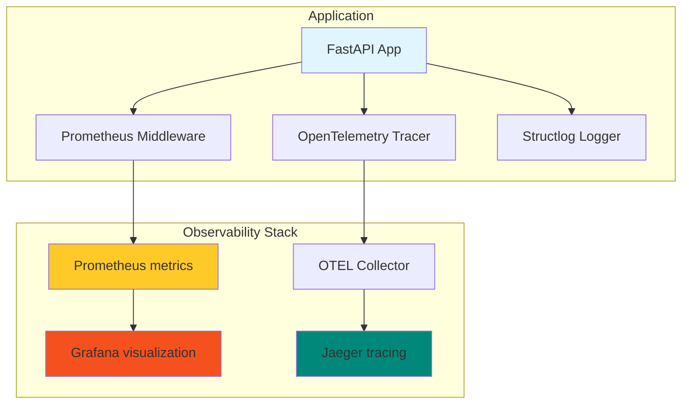

# Comprehensive Monitoring & Observability Implementation

This document describes the monitoring and observability stack implemented for the BaliBlissed Backend.

## Overview

The monitoring solution provides production-grade observability using:

| Component | Technology | Purpose |
| --------- | ---------- | ------- |
| **Metrics** | Prometheus | Time-series metrics collection |
| **Logging** | Structlog | Structured JSON logging with PII sanitization |
| **Tracing** | OpenTelemetry | Distributed tracing with Jaeger |
| **Visualization** | Grafana | Metrics dashboards and alerting |
| **Health Checks** | Custom FastAPI | Kubernetes-compatible probes |

## Architecture



## Quick Start

### 1. Start the Observability Stack

The recommended way to start the environment is using the helper script, which ensures all profiles and variables are correctly loaded:

```bash
# Start all services (Postgres, Redis, Prometheus, Grafana, Jaeger, OTEL Collector)
./scripts/run.sh start
```

For manual control via Docker Compose:

```bash
# Start with OTEL profile enabled
docker-compose --profile otel up -d
```

### 2. Access the Tools

| Service | URL | Credentials |
| ------- | --- | ----------- |
| Grafana | <http://localhost:3000> | admin/admin |
| Prometheus | <http://localhost:9090> | - |
| Jaeger UI | <http://localhost:16686> | - |
| Application | <http://localhost:8000> | - |

### 3. View Metrics

- **Prometheus targets**: <http://localhost:9090/targets>
- **Metrics endpoint**: <http://localhost:8000/metrics>
- **Health check**: <http://localhost:8000/health>
- **Liveness probe**: <http://localhost:8000/health/live>
- **Readiness probe**: <http://localhost:8000/health/ready>

## Module Structure

```text
app/monitoring/
├── __init__.py      # Public API exports
├── prometheus.py    # Prometheus metrics collection
├── logging.py       # Structured logging with PII sanitization
├── tracing.py       # OpenTelemetry distributed tracing
└── health.py        # Kubernetes-compatible health checks
```

## Metrics Reference

### HTTP Metrics (Auto-instrumented)

These metrics are automatically collected by `prometheus-fastapi-instrumentator`:

| Metric | Type | Description |
| ------ | ---- | ----------- |
| `http_requests_total` | Counter | Total HTTP requests by method, status, handler |
| `http_request_duration_seconds` | Histogram | Request latency by handler |
| `http_request_size_bytes` | Histogram | Request size distribution |
| `http_response_size_bytes` | Histogram | Response size distribution |

### Custom Application Metrics

| Metric | Type | Labels | Description |
| ------ | ---- | ------ | ----------- |
| `baliblissed_cache_hits_total` | Counter | - | Total cache hits |
| `baliblissed_cache_misses_total` | Counter | - | Total cache misses |
| `baliblissed_ai_requests_total` | Counter | `request_type` | AI API requests |
| `baliblissed_ai_request_duration_seconds` | Histogram | `request_type` | AI request latency |
| `baliblissed_ai_tokens_used_total` | Counter | `request_type` | Token usage |
| `baliblissed_circuit_breaker_state` | Gauge | `breaker_name` | Circuit breaker state |
| `baliblissed_rate_limit_hits_total` | Counter | `endpoint` | Rate limit hits |
| `baliblissed_system_cpu_percent` | Gauge | - | CPU usage percentage |
| `baliblissed_system_memory_percent` | Gauge | - | Memory usage percentage |
| `baliblissed_system_disk_percent` | Gauge | - | Disk usage percentage |

### Circuit Breaker States

| State | Value |
| ----- | ----- |
| Closed | 0 |
| Open | 1 |
| Half-Open | 2 |

## Health Check Endpoints

### Kubernetes-Compatible Probes

#### Liveness Probe: `GET /health/live`

Returns immediately with HTTP 200 if the application is responsive. No external dependencies are checked.

**Response:**

```json
{
  "status": "live",
  "timestamp": "2025-01-01T12:00:00Z"
}
```

#### Readiness Probe: `GET /health/ready`

Checks all external dependencies. Returns HTTP 503 if any check fails.

**Response (Success):**

```json
{
  "status": "ready",
  "timestamp": "2025-01-01T12:00:00Z",
  "version": "1.0.0",
  "checks": {
    "database": {"status": "pass", "response_ms": 15},
    "redis": {"status": "pass", "response_ms": 5},
    "disk": {"status": "pass", "usage_percent": 45}
  }
}
```

**Response (Failure):**

```json
{
  "status": "not_ready",
  "timestamp": "2025-01-01T12:00:00Z",
  "version": "1.0.0",
  "checks": {
    "database": {
      "status": "fail",
      "response_ms": 2000,
      "message": "Connection timeout"
    }
  }
}
```

### Timeout Configuration

| Component | Timeout |
| --------- | ------- |
| Database | 2 seconds |
| Redis | 1 second |
| Disk | No timeout |

### Legacy Health Endpoint

The original `/health` endpoint is preserved for backward compatibility and includes additional service information.

## Logging

### Structured Logging

The application uses structlog for structured JSON logging in production:

```python
from app.monitoring import get_logger

logger = get_logger(__name__)
logger.info("User action", user_id="123", action="login")
```

**Production Output:**

```json
{
  "event": "User action",
  "user_id": "123",
  "action": "login",
  "timestamp": "2025-01-01T12:00:00Z",
  "trace_id": "abc123...",
  "level": "info"
}
```

**Development Output:**

```text
2025-01-01 12:00:00 [info] User action user_id=123 action=login
```

### PII Sanitization

Sensitive data is automatically redacted from logs:

- Email addresses → `[REDACTED_EMAIL]`
- Phone numbers → `[REDACTED_PHONE]`
- Credit card numbers → `[REDACTED_CC]`
- SSN patterns → `[REDACTED_SSN]`
- JWT tokens → `[REDACTED_JWT]`
- Authorization headers → `[REDACTED]`
- Cookie values → `[REDACTED]`
- API keys → `[REDACTED]`

### Request Context

Use `bind_request_id()` to add correlation IDs:

```python
from app.monitoring.logging import bind_request_id, clear_context

# At request start
bind_request_id(str(uuid.uuid4()))

# All subsequent logs will include request_id
logger.info("Processing request")

# At request end
clear_context()
```

## Distributed Tracing

### Configuration

Tracing is configured via environment variables:

```bash
# Service identification
OTEL_SERVICE_NAME=baliblissed-backend
OTEL_SERVICE_VERSION=1.0.0

# OTLP exporter (Jaeger)
# When running backend on Host (Mac) and Jaeger in Docker:
OTEL_EXPORTER_OTLP_ENDPOINT=http://localhost:4317

# When running both in Docker:
# OTEL_EXPORTER_OTLP_ENDPOINT=http://jaeger:4317

# Sampling rate
# Development: 1.0 (100%)
# Production: 0.1 (10%)
OTEL_TRACES_SAMPLER_ARG=1.0

# Exclude URLs from tracing
OTEL_PYTHON_FASTAPI_EXCLUDED_URLS=/metrics,/health,/health/live,/health/ready,/favicon.ico
```

> [!IMPORTANT]
> For host-based development on macOS, ensure `OTEL_EXPORTER_OTLP_ENDPOINT` points to `localhost:4317` to reach the Jaeger collector container.

### Manual Span Creation

```python
from app.monitoring import tracer

with tracer.start_as_current_span("my_operation") as span:
    span.set_attribute("key", "value")
    # Your code here
```

### Adding Span Attributes

```python
from app.monitoring.tracing import add_span_attributes, record_exception

# Add attributes to current span
add_span_attributes(user_id="123", action="purchase")

# Record exceptions
try:
    risky_operation()
except Exception as e:
    record_exception(e)
```

### Trace-Log Correlation

Traces are automatically correlated with logs via `trace_id` and `span_id` fields:

```json
{
  "event": "Processing payment",
  "trace_id": "4bf92f3577b34da6a3ce929d0e0e4736",
  "span_id": "00f067aa0ba902b7",
  "level": "info"
}
```

## Grafana Dashboards

### Pre-configured Dashboards

| Dashboard | File | Purpose |
| --------- | ---- | ------- |
| **FastAPI Overview** | `fastapi-overview.json` | RPS, error rate, latency percentiles |
| **Infrastructure** | `infrastructure.json` | CPU, memory, disk usage |

These dashboards are automatically provisioned into the **"BaliBlissed"** folder upon Grafana startup.

### Key PromQL Queries

```promql
# Request Rate (RPS)
sum(rate(http_requests_total[5m]))

# Error Rate Percentage
sum(rate(http_requests_total{status=~"5.."}[5m])) / sum(rate(http_requests_total[5m]))

# P95 Latency
histogram_quantile(0.95, sum(rate(http_request_duration_seconds_bucket[5m])) by (le))

# P99 Latency
histogram_quantile(0.99, sum(rate(http_request_duration_seconds_bucket[5m])) by (le))

# Cache Hit Rate
baliblissed_cache_hits_total / (baliblissed_cache_hits_total + baliblissed_cache_misses_total)

# Circuit Breaker State
baliblissed_circuit_breaker_state{breaker_name="ai_circuit_breaker"}
```

## Security Considerations

### Metrics Endpoint Security

The `/metrics` endpoint exposes application metrics and **should never be publicly accessible** in production. Unauthorized access could reveal:

- Request rates and error patterns (information disclosure)
- Cache hit/miss ratios (business intelligence)
- System resource usage (potential attack surface)

Choose one of the following approaches based on your infrastructure:

---

#### **Option 1: Reverse Proxy IP Restriction (Recommended)**

Use nginx, Traefik, or your cloud load balancer to restrict `/metrics` access to internal networks only.

**Nginx Configuration:**

```nginx
server {
    listen 80;
    server_name api.baliblissed.com;

    # Public API routes - allow all
    location / {
        proxy_pass http://backend:8000;
        proxy_set_header Host $host;
        proxy_set_header X-Real-IP $remote_addr;
    }

    # Metrics endpoint - INTERNAL ONLY
    location /metrics {
        # Allow private network ranges
        allow 10.0.0.0/8;      # Private network (AWS VPC, etc.)
        allow 172.16.0.0/12;   # Docker networks
        allow 192.168.0.0/16;  # Local networks
        allow 127.0.0.1;       # Localhost
        
        # Deny all other requests
        deny all;
        
        proxy_pass http://backend:8000/metrics;
        proxy_set_header Host $host;
    }
}
```

**Traefik Configuration (Docker Compose):**

```yaml
services:
  backend:
    labels:
      # Public API router
      - "traefik.http.routers.api.rule=Host(`api.baliblissed.com`) && !Path(`/metrics`)"
      - "traefik.http.routers.api.entrypoints=websecure"
      
      # Metrics router with IP whitelist
      - "traefik.http.routers.metrics.rule=Host(`api.baliblissed.com`) && Path(`/metrics`)"
      - "traefik.http.routers.metrics.entrypoints=websecure"
      - "traefik.http.middlewares.metrics-ipwhitelist.ipwhitelist.sourcerange=10.0.0.0/8,172.16.0.0/12,192.168.0.0/16,127.0.0.1"
      - "traefik.http.routers.metrics.middlewares=metrics-ipwhitelist"
```

**AWS ALB/Target Group Approach:**

```yaml
# CloudFormation or Terraform - Don't expose metrics path in ALB rules
Resources:
  AlbListenerRule:
    Type: AWS::ElasticLoadBalancingV2::ListenerRule
    Properties:
      Actions:
        - Type: forward
          TargetGroupArn: !Ref BackendTargetGroup
      Conditions:
        - Field: path-pattern
          PathPatternConfig:
            Values:
              - /api/*      # Only expose API routes
              - /docs/*     # Optional: expose docs
              # Do NOT include /metrics
```

---

#### **Option 2: Separate Internal Port (Most Secure)**

Run metrics on a separate port bound to localhost or internal network only. This requires application configuration.

**Environment Configuration:**

```bash
# .env.production
METRICS_INTERNAL_PORT=9000
METRICS_INTERNAL_ONLY=true
```

**Prometheus Scrape Configuration:**

```yaml
# prometheus.yml
scrape_configs:
  - job_name: 'baliblissed-backend'
    static_configs:
      - targets: ['backend:9000']  # Internal port only
    metrics_path: '/metrics'
```

**Docker Compose (Internal Network Only):**

```yaml
services:
  backend:
    ports:
      - "8000:8000"    # Public API
    expose:
      - "9000"         # Internal metrics - not published to host
    environment:
      - METRICS_INTERNAL_PORT=9000

  prometheus:
    # Can access backend:9000 via Docker network
    # No external access to metrics port
```

---

#### **Option 3: Token-Based Authentication**

Add Bearer token authentication when IP restriction isn't possible (multi-cloud, complex networking).

**Implementation Note:**

This requires modifying [`app/monitoring/prometheus.py`](app/monitoring/prometheus.py:372) to add an authentication check before serving metrics. Store the token in environment variables:

```bash
# .env.production
METRICS_TOKEN=<random-32-char-token>
```

**Prometheus Scrape Configuration:**

```yaml
scrape_configs:
  - job_name: 'baliblissed-backend'
    static_configs:
      - targets: ['backend:8000']
    metrics_path: '/metrics'
    authorization:
      type: Bearer
      credentials: '<METRICS_TOKEN>'
```

---

### Docker Compose Security (Development)

For local development, bind monitoring services to localhost only:

```yaml
# docker-compose.yaml
services:
  prometheus:
    ports:
      - "127.0.0.1:9090:9090"  # Localhost only

  grafana:
    ports:
      - "127.0.0.1:3000:3000"  # Localhost only

  jaeger:
    ports:
      - "127.0.0.1:16686:16686"  # Localhost only
```

This prevents accidental exposure of monitoring UIs on public networks.

---

### Verification

Test your metrics endpoint security:

```bash
# 1. Verify metrics are NOT accessible externally
# From outside your network (should fail with 403 or timeout)
curl -I https://api.baliblissed.com/metrics
# Expected: HTTP 403 Forbidden or connection timeout

# 2. Verify metrics ARE accessible internally
# From within your network/VPC (should succeed)
curl http://internal-lb:8000/metrics
# Expected: Prometheus metrics output

# 3. Verify Prometheus can scrape
# Check Prometheus UI: http://localhost:9090/targets
# Status should be "UP" for baliblissed-backend
```

---

### Alternative: Disable Metrics in Production

If you don't have internal monitoring infrastructure, disable metrics entirely:

```bash
# .env.production
ENABLE_METRICS=false
```

This removes the `/metrics` endpoint completely.

### Cardinality Protection

The following high-cardinality fields are **NEVER** used as metric labels:

- `user_id` - Unbounded unique values
- `session_id` - Unbounded unique values
- `request_id` - Unique per request
- `email` - PII + high cardinality
- `full_path` - Can include IDs

### PII Redaction Configuration

Configure additional PII patterns in `app/monitoring/logging.py`:

```python
PII_PATTERNS: list[tuple[re.Pattern, str]] = [
    (re.compile(r"[a-zA-Z0-9._%+-]+@[a-zA-Z0-9.-]+\.[a-zA-Z]{2,}"), "[REDACTED_EMAIL]"),
    # Add your patterns here
]
```

## Production Deployment Checklist

- [ ] PII redaction tested (verify no emails/passwords in logs/traces)
- [ ] Cardinality limits enforced (no user_id, session_id as labels)
- [ ] Health check timeouts configured (DB: 2s, Redis: 1s)
- [ ] Metrics endpoint access restricted (internal IPs only)
- [ ] Sampling configured (10-20% in production)
- [ ] Graceful degradation verified (app starts without OTLP collector)
- [ ] Dashboards provisioned and tested in local Grafana
- [ ] Alert rules documented (error rate > 5%, P99 latency > 2s)
- [ ] Log aggregation configured (Datadog/CloudWatch/ELK)
- [ ] Retention policies set for metrics and traces

## Environment Variables Reference

| Variable | Default | Description |
| -------- | ------- | ----------- |
| `ENVIRONMENT` | `development` | Environment name (affects logging format) |
| `OTEL_SERVICE_NAME` | `baliblissed-backend` | Service name for traces |
| `OTEL_EXPORTER_OTLP_ENDPOINT` | - | OTLP collector URL |
| `OTEL_TRACES_SAMPLER_ARG` | `1.0` | Sampling ratio (0.0-1.0) |
| `OTEL_PYTHON_FASTAPI_EXCLUDED_URLS` | `/metrics,/health...` | URLs to exclude from tracing |
| `GRAFANA_ADMIN_PASSWORD` | `admin` | Grafana admin password |

## Troubleshooting

### Metrics Not Appearing in Prometheus

1. **Check Prometheus targets**: <http://localhost:9090/targets>.
2. **Verify Host Bridge**: If running backend on Host, ensure `prometheus.yml` targets `host.docker.internal:8000`.
3. **Verify Settings**: Ensure `ENABLE_METRICS=true` is set in your `.env`.
4. **Trusted Hosts**: Ensure `host.docker.internal` is in your `TRUSTED_HOSTS` list in `settings.py`.

### Traces Not Appearing in Jaeger

1. **Verify Jaeger is running**: <http://localhost:16686>.
2. **Check OTLP endpoint**: Ensure it points to `localhost:4317` (Host) or `jaeger:4317` (Docker).
3. **Check Collector Profile**: Ensure the `otel-collector` is running (use `./scripts/run.sh start`).
4. **Internal Spans**: Verify that `setup_tracing(app)` is called in `main.py`.

### High Memory Usage

1. Check for cardinality explosion in custom metrics
2. Review histogram bucket configuration
3. Verify PII redaction is not creating unique log entries
4. Check trace sampling configuration

### Health Checks Failing

1. Check database connectivity: Verify `DATABASE_URL`
2. Check Redis connectivity: Verify `REDIS_URL` or `REDIS_HOST`
3. Review timeout values in `app/monitoring/health.py`
4. Check application logs for dependency errors

## Migration from Legacy Metrics

The old JSON metrics endpoint at `/metrics` has been moved to `/metrics/legacy`.

**Old format (legacy):**

```json
{
  "timestamp": "2025-01-01",
  "api_metrics": {"requests": 100},
  "system_metrics": {"cpu": 45.2}
}
```

**New format (Prometheus):**

```text
# HELP http_requests_total Total HTTP requests
# TYPE http_requests_total counter
http_requests_total{method="GET",status="200",handler="/"} 100
```

Update your monitoring tools to use the new Prometheus format at `/metrics`.

## Further Reading

- [Prometheus Documentation](https://prometheus.io/docs/)
- [OpenTelemetry Python](https://opentelemetry.io/docs/instrumentation/python/)
- [Structlog Documentation](https://www.structlog.org/)
- [Grafana Tutorials](https://grafana.com/tutorials/)
- [Kubernetes Health Probes](https://kubernetes.io/docs/tasks/configure-pod-container/configure-liveness-readiness-startup-probes/)
