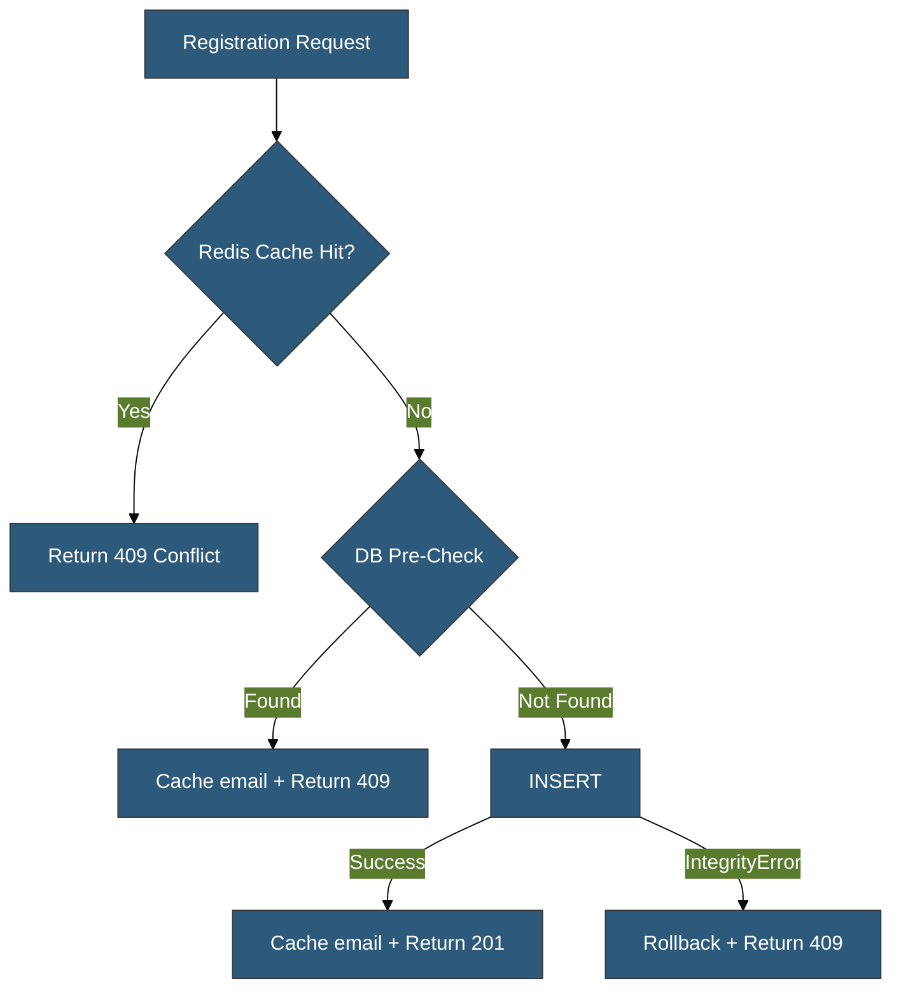

# Implementation Plan: Duplicate Detection Performance Improvements

| Document Info | Details |
| ------------- | ------- |
| **Author** | AI Architecture Analysis |
| **Date** | 2026-02-25 |
| **Status** | Draft |
| **Analysis** | [DUPLICATION_CREATION.md](/docs/analysis/DUPLICATION_CREATION.md) |
| **Target Scale** | 1,000,000+ user records |

---

## Goal

Implement the indexing strategies and architectural optimizations identified in the [Duplicate Detection Analysis](/docs/analysis/DUPLICATION_CREATION.md) to maintain low-latency queries as the user table scales to 1M+ records. Each phase is independently deployable and delivers measurable improvements.

---

## Phase 1 — Case-Insensitive Email Index & Normalization

### **Priority: High | Effort: 3h | Risk: Low**

> [!IMPORTANT]
> This is the highest-impact change. It prevents semantic duplicate emails (`User@Example.COM` vs `user@example.com`) and establishes a foundation for all email-based lookups.

#### 1.1 Application-Level Email Normalization

##### [MODIFY] [user.py](/app/repositories/user.py)

Normalize email to lowercase **before** insertion and lookup:

```diff
 async def create(
     self,
     schema: UserCreate,
     timezone: str | None = None,
     auth_provider: str = "email",
     provider_id: str | None = None,
     *,
     is_verified: bool = False,
     **kwargs: dict[str, Any],
 ) -> UserDB:
     password_hash = None
     if schema.password:
         password_hash = await hash_password(schema.password.get_secret_value())

+    # Normalize email to lowercase for consistent duplicate detection
+    normalized_email = schema.email.strip().lower()

     db_user = UserDB(
         username=schema.username,
-        email=schema.email,
+        email=normalized_email,
         password_hash=password_hash,
         ...
     )
     return await self.add_and_refresh(db_user)
```

#### [MODIFY] [user.py](/app/repositories/user.py)

Update `get_by_email` to normalize input:

```diff
 async def get_by_email(self, email: str) -> UserDB | None:
-    return await self.get_by_field("email", email)
+    return await self.get_by_field("email", email.strip().lower())
```

### 1.2 Case-Insensitive Email Index Migration

#### [NEW] `alembic/versions/YYYYMMDD_HHMM_case_insensitive_email.py`

```python
"""Replace case-sensitive email index with case-insensitive functional index.

Revision ID: auto-generated
Revises: 62fc3efa8fe0
"""

from collections.abc import Sequence

from alembic import op

revision: str = "auto-generated"
down_revision: str | Sequence[str] | None = "62fc3efa8fe0"
branch_labels: str | Sequence[str] | None = None
depends_on: str | Sequence[str] | None = None


def upgrade() -> None:
    """Replace ix_users_email with case-insensitive index."""
    # Step 1: Normalize existing emails to lowercase
    connection = op.get_bind()
    connection.execute(
        text("UPDATE users SET email = LOWER(TRIM(email)) WHERE email != LOWER(TRIM(email))")
    )

    # Step 2: Drop old case-sensitive unique index
    op.drop_index("ix_users_email", table_name="users")

    # Step 3: Create case-insensitive functional index
    op.execute(
        "CREATE UNIQUE INDEX ix_users_email_lower ON users (LOWER(email))"
    )


def downgrade() -> None:
    """Revert to case-sensitive email index."""
    op.drop_index("ix_users_email_lower", table_name="users")
    op.create_index("ix_users_email", "users", ["email"], unique=True)
```

> [!WARNING]
> The backfill `UPDATE` may briefly lock rows if run on a large dataset. Consider running `UPDATE` in batches of 10,000 rows for production deployments with >100K records.

---

## Phase 2 — Pre-Creation Existence Check

### **Priority: Medium | Effort: 4h | Risk: Low**

#### 2.1 Lightweight Existence Check Method

##### [MODIFY] [base.py](/app/repositories/base.py)

Add a lightweight `field_exists` method that avoids loading the full model:

```diff
+from sqlalchemy import exists as sa_exists
+
 class BaseRepository[ModelT: SQLModel, CreateSchemaT: BaseModel, UpdateSchemaT: BaseModel]:
 
+    async def field_exists(self, field_name: str, value: FilterValue) -> bool:
+        """
+        Check if a record with the given field value exists.
+
+        Uses SELECT EXISTS for minimal I/O — no heap tuple deserialization.
+
+        Args:
+            field_name: Column name to check
+            value: Value to match
+
+        Returns:
+            True if a matching record exists
+        """
+        field = getattr(self.model, field_name)
+        statement = select(sa_exists().where(field == value))
+        result = await self.session.execute(statement)
+        return bool(result.scalar())
```

### 2.2 Pre-Check in UserRepository.create()

#### [MODIFY] [user.py](/app/repositories/user.py)

Add a pre-check before the INSERT:

```diff
+from sqlalchemy import select
+from app.errors.database import DuplicateEntryError
+
 async def create(self, schema: UserCreate, ...) -> UserDB:
     password_hash = None
     if schema.password:
         password_hash = await hash_password(schema.password.get_secret_value())

     normalized_email = schema.email.strip().lower()

+    # Pre-check: detect duplicates before INSERT to avoid
+    # unnecessary transaction rollbacks and WAL writes.
+    # Note: DB constraint is still the authoritative guard (TOCTOU safe).
+    existing = await self.session.execute(
+        select(UserDB.uuid, UserDB.email, UserDB.username).where(
+            (UserDB.email == normalized_email) | (UserDB.username == schema.username)
+        ).limit(1)
+    )
+    conflict = existing.first()
+    if conflict:
+        if conflict.email == normalized_email:
+            raise DuplicateEntryError(
+                detail=f"User with email '{schema.email}' already exists"
+            )
+        raise DuplicateEntryError(
+            detail=f"User with username '{schema.username}' already exists"
+        )

     db_user = UserDB(
         username=schema.username,
         email=normalized_email,
         ...
     )
     return await self.add_and_refresh(db_user)
```

**Trade-off:** Success path adds ~1 ms (one index lookup). Duplicate path saves ~5-8 ms (avoids rollback + WAL writes). Net positive at any duplicate rate above ~15%.

> [!NOTE]
> The DB unique constraint in `add_and_refresh()` is **retained** as the authoritative guard against race conditions. The pre-check is a performance optimization, not a correctness mechanism.

---

## Phase 3 — Composite OAuth Index

### **Priority: Medium | Effort: 1h | Risk: Low**

#### [NEW] `alembic/versions/YYYYMMDD_HHMM_composite_oauth_index.py`

```python
"""Add composite index for OAuth provider lookups.

Revision ID: auto-generated
Revises: <phase_1_revision>
"""

from collections.abc import Sequence

from alembic import op

revision: str = "auto-generated"
down_revision: str | Sequence[str] | None = "<phase_1_revision>"
branch_labels: str | Sequence[str] | None = None
depends_on: str | Sequence[str] | None = None


def upgrade() -> None:
    """Add composite index on (auth_provider, provider_id)."""
    op.create_index(
        "ix_users_auth_provider_provider_id",
        "users",
        ["auth_provider", "provider_id"],
        unique=False,
    )


def downgrade() -> None:
    """Remove composite OAuth index."""
    op.drop_index("ix_users_auth_provider_provider_id", table_name="users")
```

**Expected improvement:** OAuth login lookups that filter on both `auth_provider` and `provider_id` will use the composite index instead of scanning `ix_users_provider_id` + heap filter. Estimated improvement: 30-50% faster OAuth lookups.

---

## Phase 4 — Consistent Duplicate Handling Across Flows

### **Priority: Low | Effort: 2h | Risk: Low**

#### [MODIFY] [auth.py](/app/routes/auth.py)

The registration flow at line 1103 currently delegates entirely to `repo.create()` without any pre-check. After Phase 2, the pre-check is inside `UserRepository.create()`, so both OAuth and registration flows benefit automatically. No additional changes to the route are needed.

However, verify that the error handling on line 1117 properly maps `DuplicateEntryError` to a 409 response:

```python
# app/routes/auth.py:1117
except Exception as e:
    raise HTTPException(status_code=HTTP_400_BAD_REQUEST, detail=str(e)) from e
```

> [!CAUTION]
> This broad `except Exception` catches `DuplicateEntryError` and re-raises it as 400 instead of the original 409. This should be fixed to let `DuplicateEntryError` propagate naturally to the exception handler registered in `app/main.py`.

#### [MODIFY] [auth.py](/app/routes/auth.py)

```diff
-    except Exception as e:
-        raise HTTPException(status_code=HTTP_400_BAD_REQUEST, detail=str(e)) from e
+    except DuplicateEntryError:
+        raise  # Let the global exception handler return 409
+    except Exception as e:
+        raise HTTPException(status_code=HTTP_400_BAD_REQUEST, detail=str(e)) from e
```

---

## Phase 5 — Connection Pool Tuning (Pre-Scale)

### **Priority: Low | Effort: 2h | Risk: Medium**

#### [MODIFY] [settings.py](/app/configs/settings.py)

Update default pool settings for production-readiness:

```diff
 # Database Connection Pool Settings (lines 226-229)
-POOL_SIZE: int = 5
-MAX_OVERFLOW: int = 10
+POOL_SIZE: int = 10
+MAX_OVERFLOW: int = 20
 POOL_TIMEOUT: int = 30
 POOL_RECYCLE: int = 3600
```

> [!NOTE]
> These are **recommended defaults** for a single application instance targeting 1M users. Final values should be tuned based on actual monitoring data (pool wait times, active connections, pg_stat_activity). For multi-instance deployments, use `POOL_SIZE = max_connections / num_instances`.

---

## Phase 6 — Redis Cache for Duplicate Detection (Future)

### **Priority: Low | Effort: 8h | Risk: Medium**

This phase is **deferred** pending actual traffic patterns. It is only worthwhile if:

- Duplicate registration attempts exceed 10% of total registrations
- Database connection pool utilization exceeds 80% during peak

### Architecture



### Cache Invalidation Concerns

| Event | Action |
| ----- | ------ |
| User created | SET `user:email:{email}` with 1h TTL |
| User email changed | DEL old key, SET new key |
| User deleted | DEL `user:email:{email}` |
| Cache miss (false negative) | DB constraint catches it |
| Cache stale (false positive) | User sees "email taken" for up to 1h after deletion |

> [!WARNING]
> False positives from stale cache entries could block legitimate registrations. Use a short TTL (5-15 min) or event-driven invalidation via PostgreSQL `LISTEN/NOTIFY`.

---

## Verification Plan

### Automated Tests

Each phase includes specific verification steps:

#### Phase 1 Verification

```bash
# 1. Run existing registration tests to ensure no regression
uv run pytest tests/auth/test_registration_flow.py -v

# 2. Verify migration applies cleanly
uv run alembic upgrade head

# 3. Verify index exists in database
# Connect to PostgreSQL and run:
# SELECT indexname, indexdef FROM pg_indexes WHERE tablename = 'users' AND indexname LIKE '%email%';
# Expected: ix_users_email_lower with LOWER(email) in definition

# 4. Verify email normalization works
uv run pytest tests/auth/ -v -k "register"
```

#### Phase 2 Verification

```bash
# 1. Run all existing user tests
uv run pytest tests/ -v

# 2. Verify duplicate detection returns 409 (not 400)
# Manual test via httpx or curl:
# POST /auth/register with existing email → expect 409
# POST /auth/register with existing username → expect 409
```

#### Phase 3 Verification

```bash
# 1. Apply migration
uv run alembic upgrade head

# 2. Verify composite index exists
# SELECT indexname FROM pg_indexes WHERE tablename = 'users' AND indexname LIKE '%provider%';
# Expected: ix_users_auth_provider_provider_id
```

#### Phase 4 Verification

```bash
# 1. Run registration tests
uv run pytest tests/auth/test_registration_flow.py -v

# 2. Manual test: register with duplicate email → verify 409 (not 400)
```

### New Tests to Write

#### `tests/repositories/test_user_duplicate_detection.py` (New)

Test the pre-check logic in `UserRepository.create()`:

```python
"""Tests for user duplicate detection at repository level."""

import pytest
from app.errors.database import DuplicateEntryError
from app.repositories.user import UserRepository
from app.schemas.user import UserCreate


@pytest.mark.asyncio
async def test_create_duplicate_email_raises_error(
    user_repo: UserRepository,
    sample_user_create: UserCreate,
) -> None:
    """Creating a user with an existing email raises DuplicateEntryError."""
    await user_repo.create(sample_user_create)
    with pytest.raises(DuplicateEntryError, match="email"):
        await user_repo.create(sample_user_create)


@pytest.mark.asyncio
async def test_create_duplicate_email_case_insensitive(
    user_repo: UserRepository,
    sample_user_create: UserCreate,
) -> None:
    """Email duplicate detection is case-insensitive."""
    await user_repo.create(sample_user_create)
    upper_create = sample_user_create.model_copy(
        update={"email": sample_user_create.email.upper(), "userName": "different_user"}
    )
    with pytest.raises(DuplicateEntryError, match="email"):
        await user_repo.create(upper_create)


@pytest.mark.asyncio
async def test_create_duplicate_username_raises_error(
    user_repo: UserRepository,
    sample_user_create: UserCreate,
) -> None:
    """Creating a user with an existing username raises DuplicateEntryError."""
    await user_repo.create(sample_user_create)
    different_email = sample_user_create.model_copy(
        update={"email": "different@example.com"}
    )
    with pytest.raises(DuplicateEntryError, match="username"):
        await user_repo.create(different_email)
```

> [!NOTE]
> These tests require a real database session (integration tests). They cannot rely on mocked repositories since we're testing the actual SQL behavior.

### Manual Verification

1. **Apply all migrations**: `uv run alembic upgrade head`
2. **Register a new user** via `POST /auth/register`
3. **Attempt duplicate email** (same email, different case) → expect `409 Conflict`
4. **Attempt duplicate username** → expect `409 Conflict`
5. **Check PostgreSQL indexes**: `\di+ users` in psql to verify new indexes

---

## Summary: Expected Impact at 1M Records

| Optimization | Latency Impact | I/O Impact | Effort |
| ------------ | -------------- | ---------- | ------ |
| Case-insensitive email index | Negligible | Same | 3h |
| Email normalization | Negligible | Same | 30min |
| Pre-creation check | +1ms success, -5ms duplicate | -2 WAL writes on dup | 4h |
| Composite OAuth index | -30% OAuth lookups | -1 page read | 1h |
| Fix 400→409 error mapping | None | None | 30min |
| Pool tuning | -50ms under contention | No change | 2h |
| Redis cache (future) | -1ms cache hit | -1 DB roundtrip | 8h |

---

## *End of Implementation Plan*
